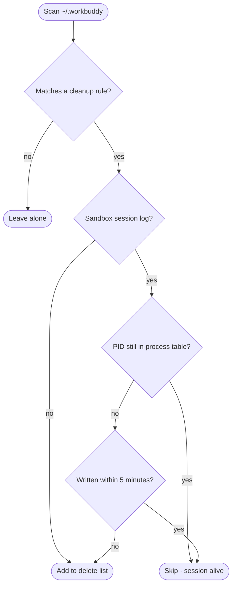

<h1 align="center">🧹 workbuddy-sweep</h1>

<p align="center">
  <strong>Subtract from <code>~/.workbuddy</code></strong><br>
  Scan → preview → confirm → clean. Nothing is deleted by default.
</p>

<p align="center">
  <a href="https://github.com/Congxiang1994/workbuddy-sweep"></a>
  <a href="https://github.com/Congxiang1994/workbuddy-sweep"></a>
  <a href="https://github.com/Congxiang1994/workbuddy-sweep"></a>
  <a href="https://github.com/Congxiang1994/workbuddy-sweep/blob/main/tests/run-tests.sh"></a>
  <a href="https://github.com/Congxiang1994/workbuddy-sweep"></a>
  <a href="LICENSE"></a>
</p>

<p align="center">
  <a href="README.md">简体中文</a> · <strong>English</strong>
</p>

---

[WorkBuddy](https://workbuddy.cn) writes logs, sandbox sessions, traces and caches into `~/.workbuddy` every day. Give it a few weeks and it grows from a few hundred megabytes to several gigabytes.

`workbuddy-sweep` takes that space back. It only touches three kinds of data — **cache, history, and finished sessions**. Runtime, installed plugins, project data, credentials and memory are never touched.

```diff
  ~/.workbuddy   1.9G
-    ├─ logs/sandbox/            420M   finished sandbox session logs
-    ├─ plugins/marketplaces/    146M   unzipped marketplace manifests
-    ├─ app/session/Cache/        57M   Electron renderer cache
-    └─ traces/                   45M   debug telemetry
+ ~/.workbuddy   1.3G   ← after a default cleanup
```

## Where the space goes

Measured breakdown of the default cleanup list (author's machine, 2026-09-16):

```
logs/sandbox/     ██████████████████████████████   420.0M   finished sessions
cache dirs        ████                              62.0M   redundant dirs
app/session/      ████                              57.0M   Electron caches
traces/           ███                               45.0M   idle telemetry
logs/             ▌                                  8.4M   rotated logs
.DS_Store         ▏                                  0.4M   stray markers
──────────────────────────────────────────────────────────────
                                    total ≈ 588.8M (84 items)
plugins/marketplaces/  ██████████                  146.0M   ⚡ --aggressive
```

> [!NOTE]
> `logs/sandbox/` usually dominates. Those files are written **today**, so traditional "delete logs older than today" rules never catch a single one — which is the whole reason this script exists.

## Decision logic



Two gates plus a cooldown: **if the process is alive, nothing is touched**. Neither is anything just written. Everything else goes on the list.

## What it deletes

| # | Category | Rule | Measured |
|---|---|---|---|
| 1 | `logs/` dated dirs | older than today | 3.4M |
| 2 | `logs/*.old.log` | rotated logs | 5.0M |
| 3 | stale `logs/` files | `connector-oauth-debug.log` etc. | — |
| 4 | **`logs/sandbox/` session logs** | **PID gone** and idle ≥5 min; whole dirs dated before today | **420M** |
| 5 | `traces/*` | idle ≥ 60 min (`TRACE_MAX_AGE_MIN`) | 45M |
| 6 | cache / redundant dirs | `skills-marketplace` `connectors-marketplace` `cache` `file-tree-manifests` `shell-snapshots` `clipboard-images` `blobs` `file-history` `changes-detail` | 62M |
| 7 | **`app/session/` Electron caches** | `Cache` `Code Cache` `GPUCache` `DawnWebGPUCache` `DawnGraphiteCache` `Shared Dictionary` | 57M |
| 8 | `backup-memory-YYYYMMDD` | outdated memory backups | — |
| 9 | stray `.DS_Store` | within 3 levels of `WB_HOME` | 408K |
| ⚡ | `plugins/marketplaces/` | only with `--aggressive`; auto re-pulled on next launch | 146M |

## What it never deletes

- **Live sandbox sessions** — any `sandbox_<pid>_*` whose PID still exists in the process table is skipped
- **Active logs being written** — `daemon.log`, `main.log`, `renderer.log`, `mcp-apps-diag.log`, `file-service.log`, `AppStartup.log`, plus today's dated dir under `logs/`
- **`binaries/`** — the managed Python + Node runtime that every tool depends on
- **`plugins/cache/`** — where installed plugins actually live (`installed_plugins.json` points its `installPath` here)
- **Login state** — `WebStorage`, `IndexedDB`, `Local Storage`, `Session Storage`, `Partitions` under `app/session/`
- **Your data** — `projects/`, `security/`, `credentials/`, `memory/`, `skills/`, `workspace/`, `storage/`, `local_storage/`, `audit-log/`

## Install

```bash
curl -O https://raw.githubusercontent.com/Congxiang1994/workbuddy-sweep/main/workbuddy-sweep.sh
chmod +x workbuddy-sweep.sh
```

Or just clone this repository.

## Usage

```bash
./workbuddy-sweep.sh                        # preview: list removable items + estimated space
./workbuddy-sweep.sh --apply                # perform the deletion
./workbuddy-sweep.sh --aggressive           # preview including plugins/marketplaces
./workbuddy-sweep.sh --apply --aggressive   # clean it all in one go
```

> [!TIP]
> Run the preview without flags first, confirm the list looks right, then pass `--apply`. To rehearse on a throwaway copy, use `WB_HOME=/tmp/fake bash workbuddy-sweep.sh --apply`.

<details>
<summary><b>Environment overrides</b></summary>

<br>

| Variable | Default | Description |
|---|---|---|
| `WB_HOME` | `~/.workbuddy` | Target directory — handy for dry runs on a copy |
| `TRACE_MAX_AGE_MIN` | `60` | Minutes of idleness before a `traces/` dir is reclaimed |
| `SANDBOX_COOLDOWN_MIN` | `5` | Minutes without writes before a sandbox session counts as finished |

</details>

<details>
<summary><b>Sample output</b></summary>

<br>

The preview phase:

```
================ 扫描结果 ================

[logs/sandbox 已结束会话]
  128.7M   logs/sandbox/20260916  pid=6721（14 个文件）
  100.3M   logs/sandbox/20260916  pid=6445(center)（10 个文件）

[traces 闲置追踪]
  14.0M    traces/5550/（闲置 197 分钟）

[Electron 渲染缓存]
  53.6M    app/session/Cache
------------------------------------------
预计可释放空间: 588.8M（共 84 项）
清理前占用: 1.8G
```

After `--apply`, the tail reports the actual freed space and the resulting usage:

```
================ 开始删除 ================
  [DEL] logs/sandbox/20260916  pid=6721（14 个文件）
  [DEL] traces/5550/
==========================================
成功 84 项，失败 0 项
实际释放空间: 588.8M（预计 588.8M）
清理后占用: 1.3G
```

*(The script's own output is Chinese.)*

</details>

## Design notes

<details>
<summary><b>Why sandbox logs are gated on PID liveness</b></summary>

<br>

Files under `logs/sandbox/` are named `sandbox_[center_]<pid>_{NNN.log,mmap3}`. If the PID is still in the process table the session hasn't ended, and its `.mmap3` is a memory-mapped file being written to right now — deleting it would break the session.

The liveness chain: `ps -p <pid>` first, falling back to `kill -0 <pid>` in restricted environments (inside an agent sandbox, `ps` fails outright with `operation not permitted`). When neither is conclusive, the `SANDBOX_COOLDOWN_MIN` cooldown is the backstop — anything written recently is skipped.

</details>

<details>
<summary><b>Why there is not a single bare <code>$var</code> in the script</b></summary>

<br>

bash decides where a variable name ends using **the locale-dependent `isalnum()`**. Under a UTF-8 locale, a multibyte character immediately following `$var` (such as the fullwidth `（`) gets swallowed into the variable name:

```bash
printf 'set -u\npidlabel="OK"\necho "值=$pidlabel（测试）"\n' > /tmp/t.sh
LC_ALL=C           /bin/bash /tmp/t.sh   # 值=OK（测试）                  exit 0
LC_ALL=en_US.UTF-8 /bin/bash /tmp/t.sh   # pidlabel: unbound variable     exit 1
```

The same script dies in your terminal and runs fine elsewhere — a nightmare to pin down. So this project uses `${var}` throughout, and the test suite covers it.

</details>

<details>
<summary><b>Why <code>plugins/cache</code> is sacred but <code>plugins/marketplaces</code> is fair game</b></summary>

<br>

- `plugins/cache/` (81M) is **where installed plugins actually live** — `installed_plugins.json` points its `installPath` straight at it. Delete it and your plugins are gone.
- `plugins/marketplaces/` (146M) is the unzipped marketplace manifest, has no `.git`, and is `autoUpdate: true`, so it is re-pulled the next time you open the marketplace. The only cost is an briefly empty listing — which is why it sits behind the `--aggressive` flag instead of the default list.

</details>

## Testing

```bash
bash tests/run-tests.sh
```

Builds an isolated fixture under `/tmp` and runs the real script under **both the `C` and `en_US.UTF-8` locales**, asserting 8 properties each:

- Exit code 0, no `unbound variable`
- Finished sessions removed, **live-PID sessions preserved**
- Historical sandbox dirs removed, idle traces reclaimed, stray `.DS_Store` removed

8 assertions × 2 locales = 16. Run it after every script change.

## Notes

> [!WARNING]
> Deleting `blobs/` and `file-history/` drops file version / edit history (**current files are unaffected**). Everything else is rebuilt automatically by WorkBuddy, invisibly.

- **macOS only** (uses BSD `stat -f`). On Linux, switch `stat -f '%m'` / `stat -f '%Sm' -t ...` to GNU `stat -c '%Y'` / `stat -c '%y'`.
- Repeated runs are idempotent — each run only handles whatever residue exists at that moment.
- Zero dependencies: only bash and the stock `du` / `stat` / `ps`.

## License

[MIT](LICENSE)
