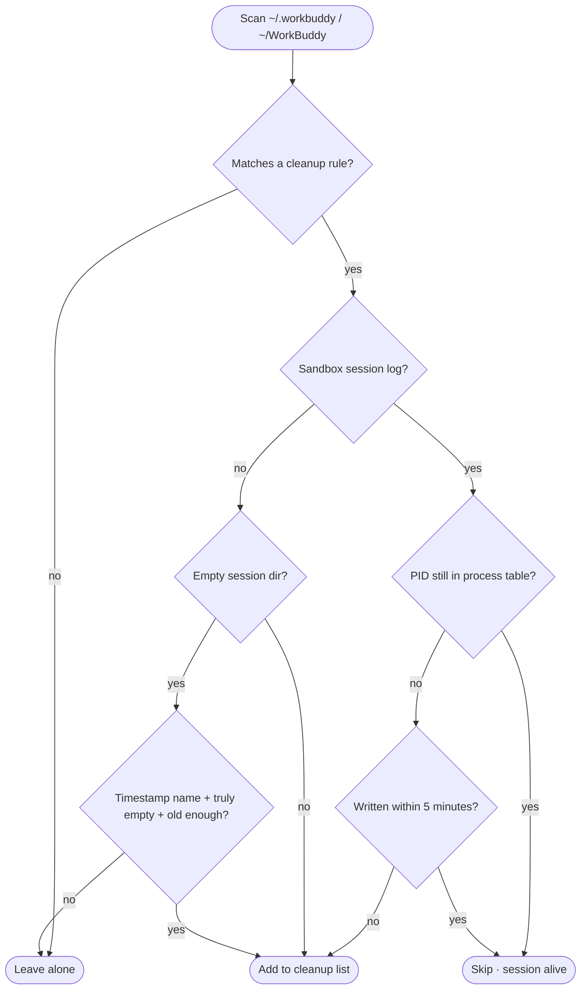
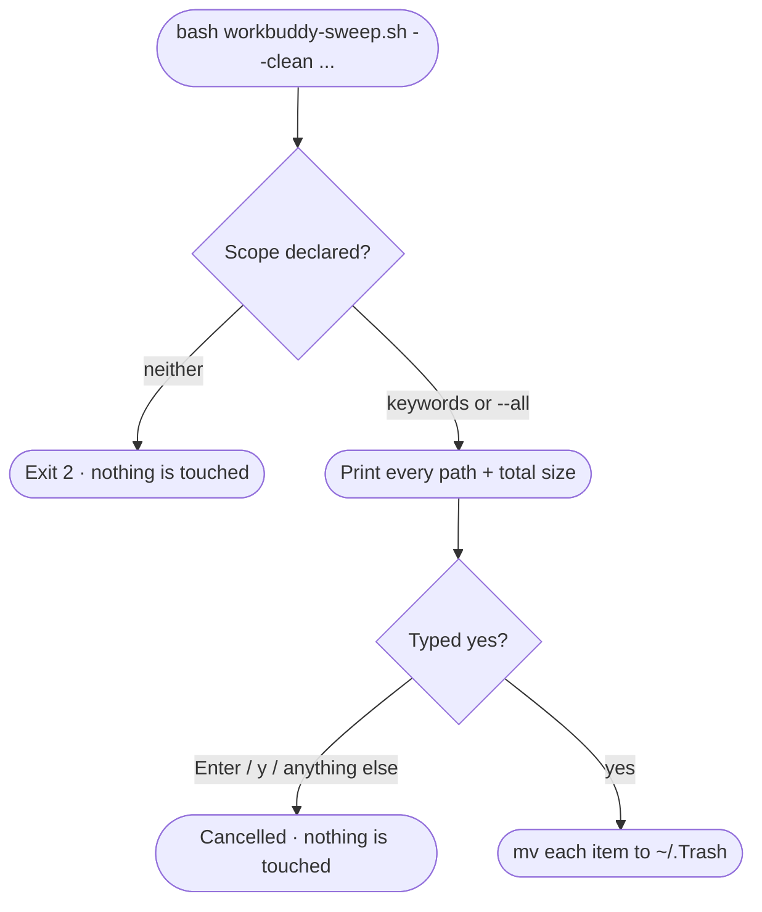

<h1 align="center">🧹 workbuddy-sweep</h1>

<p align="center">
  <strong>Subtract from <code>~/.workbuddy</code> and <code>~/Library</code></strong><br>
  Scan → preview → confirm → clean. Nothing is deleted by default.
</p>

<p align="center">
  <a href="https://github.com/Congxiang1994/workbuddy-sweep"></a>
  <a href="https://github.com/Congxiang1994/workbuddy-sweep"></a>
  <a href="https://github.com/Congxiang1994/workbuddy-sweep"></a>
  <a href="https://github.com/Congxiang1994/workbuddy-sweep/tree/main/tests"></a>
  <a href="https://github.com/Congxiang1994/workbuddy-sweep"></a>
  <a href="LICENSE"></a>
</p>

<p align="center">
  <a href="README.md">简体中文</a> · <strong>English</strong>
</p>

---

Two scripts, two different kinds of junk:

| Script | What it looks at | When it actually acts |
|---|---|---|
| **`workbuddy-sweep.sh`** | logs, caches and finished sandbox sessions under `~/.workbuddy`, plus empty session dirs under `~/WorkBuddy` | report only by default; `--clean <keywords or --all>` then type `yes` |
| **`uninstall-residue.sh`** | data left behind in `~/Library` by apps you uninstalled | report only by default; `--clean <scope>` then type `yes` |

Both follow the same cleanup protocol: **read-only by default → scope must be explicit → print the list → type `yes` → move to Trash**.

---

[WorkBuddy](https://workbuddy.cn) writes logs, sandbox sessions, traces and caches into `~/.workbuddy` every day, and leaves timestamp-named session directories under `~/WorkBuddy`. Give it a few weeks and the cache grows from a few hundred megabytes to several gigabytes while the workspace fills up with empty shells.

`workbuddy-sweep.sh` takes that back. It only touches four kinds of data — **cache, history, finished sessions, and empty directories**. Runtime, installed plugins, project data, credentials and memory are never touched.

```diff
  ~/.workbuddy   1.9G
-    ├─ logs/sandbox/            420M   finished sandbox session logs
-    ├─ plugins/marketplaces/    146M   unzipped marketplace manifests
-    ├─ app/session/Cache/        57M   Electron renderer cache
-    └─ traces/                   45M   debug telemetry
+ ~/.workbuddy   1.3G   ← after a default cleanup
```

## Where the space goes

Measured breakdown of the default cleanup list (author's machine, 2026-09-16, heavily used):

```
logs/sandbox/     ██████████████████████████████   420.0M   finished sessions
cache dirs        ████                              62.0M   redundant dirs
app/session/      ████                              57.0M   Electron caches
traces/           ███                               45.0M   idle telemetry
logs/             ▌                                  8.4M   rotated logs
.DS_Store         ▏                                  0.4M   stray markers
session dirs      ▏                                  0.0M   empty dirs (declutter only)
──────────────────────────────────────────────────────────────
                                    total ≈ 588.8M
plugins/marketplaces/  ██████████                  146.0M   ⚡ --aggressive
```

> [!NOTE]
> `logs/sandbox/` usually dominates. Those files are written **today**, so traditional "delete logs older than today" rules never catch a single one — which is the whole reason this script exists.

## Two gates

**Gate one: scan-time decisions.** What enters the list, and what never will.



**Gate two: confirmation before acting.** `--clean` alone is not enough — you must declare a scope, then type `yes`.



> [!WARNING]
> **A bare `--clean` refuses to run (exit code 2).** The scope is either a keyword filter or an explicit `--all` — a slip of the fingers can never turn into a full wipe.

## What it cleans up

| # | Category | Rule | Typical |
|---|---|---|---|
| 1 | `logs/` dated dirs | older than today | 3.4M |
| 2 | `logs/*.old.log` | rotated logs | 5.0M |
| 3 | stale `logs/` files | `connector-oauth-debug.log` etc. | — |
| 4 | **`logs/sandbox/` session logs** | **PID gone** and idle ≥5 min; whole dirs dated before today | **420M** |
| 5 | `traces/*` | idle ≥ 60 min (`TRACE_MAX_AGE_MIN`) | 45M |
| 6 | cache / redundant dirs | `skills-marketplace` `connectors-marketplace` `cache` `file-tree-manifests` `shell-snapshots` `clipboard-images` `blobs` `file-history` `changes-detail` | 62M |
| 7 | **`app/session/` Electron caches** | `Cache` `Code Cache` `GPUCache` `DawnWebGPUCache` `DawnGraphiteCache` `Shared Dictionary` | 57M |
| 8 | `backup-memory-YYYYMMDD` | outdated memory backups | — |
| 9 | stray `.DS_Store` | within 3 levels of `WB_HOME` | 408K |
| 10 | **empty session dirs under `~/WorkBuddy`** | name is exactly `YYYY-MM-DD-HH-MM-SS`, **truly empty**, and older than 60 minutes | 0 (declutter only) |
| ⚡ | `plugins/marketplaces/` | only with `--aggressive`; auto re-pulled on next launch | 146M |

## What it never touches

- **Live sandbox sessions** — any `sandbox_<pid>_*` whose PID still exists in the process table is skipped
- **Non-empty session dirs** — anything under `~/WorkBuddy` with even one entry stays
- **Directories it can't attribute** — names that aren't timestamp-shaped are never touched (e.g. `Claw`); the script won't decide for you
- **Just-created session dirs** — empty dirs younger than 60 minutes are skipped; a running session may not have written anything yet
- **Active logs being written** — `daemon.log`, `main.log`, `renderer.log`, `mcp-apps-diag.log`, `file-service.log`, `AppStartup.log`, plus today's dated dir under `logs/`
- **`binaries/`** — the managed Python + Node runtime that every tool depends on
- **`plugins/cache/`** — where installed plugins actually live (`installed_plugins.json` points its `installPath` here)
- **Login state** — `WebStorage`, `IndexedDB`, `Local Storage`, `Session Storage`, `Partitions` under `app/session/`
- **Your data** — `projects/`, `security/`, `credentials/`, `memory/`, `skills/`, `workspace/`, `storage/`, `local_storage/`, `audit-log/`

## Install

```bash
curl -O https://raw.githubusercontent.com/Congxiang1994/workbuddy-sweep/main/workbuddy-sweep.sh
curl -O https://raw.githubusercontent.com/Congxiang1994/workbuddy-sweep/main/uninstall-residue.sh
chmod +x workbuddy-sweep.sh uninstall-residue.sh
```

Or just clone this repository.

## Usage

```bash
# ① Look at the report first (deletes nothing)
./workbuddy-sweep.sh
./workbuddy-sweep.sh sandbox                 # only items whose name/path contains sandbox
./workbuddy-sweep.sh sandbox traces          # several keywords = union
./workbuddy-sweep.sh traces --and 61354      # intersection (both must match)
./workbuddy-sweep.sh --only sandbox,traces   # comma-separated = space-separated
./workbuddy-sweep.sh --aggressive            # report additionally includes plugins/marketplaces

# ② Once it looks right, clean (the list is printed, then you type yes)
./workbuddy-sweep.sh --clean sandbox         # only items containing sandbox
./workbuddy-sweep.sh --clean --all           # everything — still requires yes
./workbuddy-sweep.sh --clean --all --aggressive
./workbuddy-sweep.sh --clean sandbox --yes   # skip the confirmation (--yes requires a filter)
```

> [!TIP]
> To rehearse on a throwaway copy, use `WB_HOME=/tmp/fake WB_WORKSPACES=/tmp/fake-ws bash workbuddy-sweep.sh --clean ...`.

Filters are **case-insensitive substring** matches against the category name, the item name, or any full path inside the item:

| Form | Meaning |
|---|---|
| `a b` | union — either one matches |
| `a --and b` | intersection — both must match |
| `a,b` | comma-separated = space-separated |
| `a b --and c` | `(a OR b) AND c`, freely mixable |

> [!IMPORTANT]
> **Filtering is keyword-based only — report numbers are not accepted as filters.** Numbers depend on list ordering, so using one as a filter ties "what gets deleted" to the sort result. Keywords do not: `sandbox traces` and `traces sandbox` give identical results.

<details>
<summary><b>Environment overrides</b></summary>

<br>

| Variable | Default | Description |
|---|---|---|
| `WB_HOME` | `~/.workbuddy` | Main target directory |
| `WB_WORKSPACES` | `~/WorkBuddy` | Root of session working directories (where empty dirs are found) |
| `TRACE_MAX_AGE_MIN` | `60` | Minutes of idleness before a `traces/` dir is reclaimed |
| `SANDBOX_COOLDOWN_MIN` | `5` | Minutes without writes before a sandbox session counts as finished |
| `EMPTY_SESSION_COOLDOWN_MIN` | `60` | Minimum age (minutes) of an empty session dir |
| `MAX_DELETE_PER_RUN` | `20` | Max items processed per run, as a slip guard |

</details>

<details>
<summary><b>What the report and confirmation page look like</b></summary>

<br>

Report (measured 2026-09-17, excerpt):

```
WorkBuddy 清理  WB_HOME=/Users/cong/.workbuddy  今天=2026-09-17
模式：只扫描，不删除任何文件

================ 扫描结果 ================

[logs 轮转旧日志]
  [01]     5.7M  logs/main.old.log
  [02]     5.0M  logs/renderer.old.log

[logs/sandbox 已结束会话]
  [03]     4.1M  logs/sandbox/20260917  pid=14143（2 个文件）
  [04]     2.0M  logs/sandbox/20260917  pid=52342(center)（1 个文件）
  …

[Electron 渲染缓存]
  [28]    67.8M  app/session/Cache

[空会话目录]
  [30]       0K  会话工作目录空目录（29 个，不占空间）

------------------------------------------
命中 30 项 / 65 处 / 合计 191.2M
清理前占用: 1.4G
空会话目录旁注: 9 个非空已保留；1 个创建不足 60 分钟跳过；1 个命名不符跳过

以上仅为报告，未删除任何文件。
```

Then `--clean` takes you to the confirmation page — **every path is laid out** before you type `yes`:

```
================ 即将移入废纸篓 ================

[01] logs 轮转旧日志  ·  5.7M
       /Users/cong/.workbuddy/logs/main.old.log
[02] 会话工作目录空目录（29 个，不占空间）  ·  0K
       /Users/cong/WorkBuddy/2026-09-14-08-24-08
       /Users/cong/WorkBuddy/2026-09-15-09-26-56
       …

合计 30 项 / 65 处 / 191.2M
（这些都会进 /Users/cong/.Trash，不是真删，随时可拖回来）

以上就是要移入废纸篓的全部内容。
  yes  = 确认，全部移入废纸篓
  pick = 逐项挑选
  其它 = 取消（什么都不做）
> 
```

*(The script's own output is Chinese.)*

</details>

## Design notes

<details>
<summary><b>Why sandbox logs are gated on PID liveness</b></summary>

<br>

Files under `logs/sandbox/` are named `sandbox_[center_]<pid>_{NNN.log,mmap3}`. If the PID is still in the process table the session hasn't ended, and its `.mmap3` is a memory-mapped file being written to right now — deleting it would break the session.

The liveness chain: `ps -p <pid>` first, falling back to `kill -0 <pid>` in restricted environments (inside an agent sandbox, `ps` fails outright with `operation not permitted`). When neither is conclusive, the `SANDBOX_COOLDOWN_MIN` cooldown is the backstop — anything written recently is skipped.

</details>

<details>
<summary><b>How an empty session dir is judged "empty"</b></summary>

<br>

Directories under `~/WorkBuddy` are named after the session start time (`2026-09-17-15-00-44`). Three conditions must hold **simultaneously**:

1. **The name matches** `YYYY-MM-DD-HH-MM-SS` exactly — anything else is skipped. Other things may live alongside (such as `Claw`), and the script can't tell who owns them, so it doesn't decide for you.
2. **It is truly empty** — judged with `ls -A | head -1`; a single entry (including `.DS_Store`) means it stays.
3. **It is old enough** — dirs younger than `EMPTY_SESSION_COOLDOWN_MIN` (60 minutes by default) are skipped. A session dir is created when the session *starts*, so a brand-new empty one may belong to a running session that simply hasn't written anything yet.

Fail any one condition and it never enters the list. How many were skipped, and why, is printed in the report:

```
空会话目录旁注: 9 个非空已保留；1 个创建不足 60 分钟跳过；1 个命名不符跳过
```

> [!NOTE]
> Empty dirs take no space (`du` reports 0K), so cleaning them **frees no disk at all** — it's pure decluttering. They're listed as their own category precisely so you don't expect a size win.

</details>

<details>
<summary><b>Why it moves to Trash instead of <code>rm</code></b></summary>

<br>

`rm` is irreversible. The script uses `mv` into `~/.Trash` instead, so **you can always drag things back**. Name collisions get a timestamp suffix.

The trade-off, stated plainly: **items in the Trash still occupy disk** — space is only released once you empty it. That's why the script never claims "freed XXX MB" at the end; it tells you where the files went.

</details>

<details>
<summary><b>Why there is not a single bare <code>$var</code> in the script</b></summary>

<br>

bash decides where a variable name ends using **the locale-dependent `isalnum()`**. Under a UTF-8 locale, a multibyte character immediately following `$var` (such as the fullwidth `（`) gets swallowed into the variable name:

```bash
printf 'set -u\npidlabel="OK"\necho "值=$pidlabel（测试）"\n' > /tmp/t.sh
LC_ALL=C           /bin/bash /tmp/t.sh   # 值=OK（测试）                  exit 0
LC_ALL=en_US.UTF-8 /bin/bash /tmp/t.sh   # pidlabel: unbound variable     exit 1
```

The same script dies in your terminal and runs fine elsewhere — a nightmare to pin down. So this project uses `${var}` throughout, and the test suite covers it.

</details>

<details>
<summary><b>Why <code>plugins/cache</code> is sacred but <code>plugins/marketplaces</code> is fair game</b></summary>

<br>

- `plugins/cache/` (81M) is **where installed plugins actually live** — `installed_plugins.json` points its `installPath` straight at it. Delete it and your plugins are gone.
- `plugins/marketplaces/` (146M) is the unzipped marketplace manifest, has no `.git`, and is `autoUpdate: true`, so it is re-pulled the next time you open the marketplace. The only cost is an briefly empty listing — which is why it sits behind the `--aggressive` flag instead of the default list.

</details>

## The other half: `uninstall-residue.sh`

Uninstalling an app just drags a `.app` to the Trash — none of the data it accumulated under `~/Library` goes with it. A few months later you're staring at a pile of unfamiliar names in `Application Support`.

This script digs them out. **It only reports; it deletes nothing.** Findings are grouped by software, with every path and its size — you decide what stays.

Real output from the author's machine (2026-09-17):

```
[09] Docker Desktop
     待确认 · 合计 320K · 最近改动 2026-06-11
           232K  ~/Library/Application Support/Docker Desktop
             4K  ~/Library/Preferences/com.electron.dockerdesktop.plist
            84K  ~/Library/Group Containers/group.com.docker

[11] com.tencent.bugly
     基本确定 · 合计 36K · 最近改动 2026-09-17
             4K  ~/Library/Application Support/com.tencent.bugly
             4K  ~/Library/Preferences/com.tencent.tds.bugly.plist
             …

------------------------------------------------------
共 24 项（基本确定 19 / 待确认 5），合计 154.8M
```

> The footer counts **software entries** (traces of one app count as one), while the "hit 41" line counts **paths** — the two numbers are meant to differ.

### How it decides "uninstalled"

macOS offers no API for "is the owner of this directory still around?", so the script fingerprints instead:

1. **Collect what is actually installed** — walk `/Applications`, `/System/Applications`, `Utilities`, `~/Applications` and the input-method directories, reading each app's bundle id, name and bundle-id org segment via `PlistBuddy`;
2. **Walk the `~/Library` locations where residue piles up**;
3. Anything whose name is a standard bundle id — or looks like a software name — with no match in that fingerprint set is flagged as suspected residue.

### Scan coverage

The scan draws a progress bar (0 → 100%, with the directory it is currently walking) on `stderr`, so the report on `stdout` can still be redirected to a file.

| Location | Contents |
|---|---|
| `Application Support` | the big one; most app data lives here |
| `Caches` / `WebKit` / `HTTPStorages` | caches and WebKit storage |
| `Preferences` | `*.plist` preferences |
| `Containers` / `Group Containers` | sandbox containers (the 10-char team-id prefix is stripped) |
| `Logs` / `Saved Application State` | logs and window state |
| `LaunchAgents` / `Cookies` / `Application Scripts` / `Services` | odds and ends |

`--system` additionally scans `/Library` (read-only; cleaning there needs sudo).

### The three labels

| Label | Meaning |
|---|---|
| **基本确定** (certain) | the name is a standard software identifier (`com.xxx.yyy`), and no such software is installed |
| **待确认** (check it) | just a plain folder name (e.g. `Docker Desktop`), with no software of that name installed |
| **归属不明** (unattributed) | can't be attributed to any software — likely a system or dev-tool directory; hidden unless you pass `--all` |

### Usage

```bash
./uninstall-residue.sh                 # scan + report (deletes nothing)
./uninstall-residue.sh sogou           # only items whose name or path contains sogou
./uninstall-residue.sh sogou baidu     # several keywords = union
./uninstall-residue.sh sogou --and pinyin  # intersection: both must match
./uninstall-residue.sh --all           # include "unattributed" entries
./uninstall-residue.sh --min-age 180   # only items untouched for 180+ days
./uninstall-residue.sh --system        # also scan /Library
./uninstall-residue.sh --clean sogou   # list what will go → type yes → clean those groups
./uninstall-residue.sh --clean --all   # list everything → type yes → clean it all
```

### Cleaning only part of it

Most of the time you want a few entries gone, not the whole list — put **keywords** after `--clean`:

```bash
./uninstall-residue.sh --clean sogou              # group name or any path contains sogou
./uninstall-residue.sh --clean sogou baidu        # union: contains sogou OR baidu
./uninstall-residue.sh --clean sogou,baidu        # comma-separated, same as above
./uninstall-residue.sh --clean sogou --and pinyin # intersection: both must match
./uninstall-residue.sh --clean sogou google --and updater  # (sogou OR google) AND updater
```

Filters are **case-insensitive substring** matches against the group name or any full path inside the group:

| Form | Meaning |
|---|---|
| `a b` | union — either one matches |
| `a --and b` | intersection — both must match |
| `a,b` | comma-separated = space-separated |
| `a b --and c` | `(a OR b) AND c`, freely mixable |

> [!IMPORTANT]
> **Filtering is keyword-based only — report numbers are not accepted as filters.** Numbers depend on list ordering, so using one as a filter ties "what gets deleted" to the sort result; a different argument set could then delete the wrong thing. Keywords do not depend on ordering: `sogou baidu` and `baidu sogou` give identical results, and re-running never drifts.

### Three gates — there is no "wipe it all" one-liner

**① The scope must be spelled out.** A bare `--clean` refuses to run (exit code 2):

```
⚠️  没有指定范围，本次不会动任何文件。
    只清几项：    bash uninstall-residue.sh --clean <关键词>
    全部都要清：  bash uninstall-residue.sh --clean --all
```

**② The list comes first.** Before confirming, every path about to be trashed is printed with its size, followed by a total:

```
================ 即将移入废纸篓 ================

[01] GhostApp  ·  40K  ·  待确认
            32K  ~/Library/Application Support/GhostApp
             8K  ~/Library/Logs/GhostApp.log

[02] com.ghost.software  ·  12K  ·  基本确定
            12K  ~/Library/Caches/com.ghost.software

合计 2 组 / 3 处 / 52K
```

**③ You must type `yes`.** Enter, `y`, or anything else cancels — not a single file is touched:

```
  yes  = 确认，全部移入废纸篓
  pick = 逐组挑选
  其它 = 取消（什么都不做）
```

`--yes` skips this gate, but it **requires a filter** (`--all` does not count), so `--clean --all --yes` — the "wipe everything in one command" case — is deliberately blocked (exit code 2).

### Cleaning moves to Trash, never `rm`

Confirmed items are `mv`'d into `~/.Trash` — **drag them back to restore**. At most 20 groups per run (`MAX_DELETE_PER_RUN` is overridable).

In `pick` mode you answer per group: `y` to move the whole group, `n` to skip, `s` to pick entries one by one, `q` to quit.

> [!NOTE]
> Entries labelled **归属不明** (unattributed) are **never** touched, even with `--all`. The script can't tell who owns them, so it doesn't decide for you.

### Whitelist

System directories and resident updaters are never reported: `com.apple.*`, `com.google.*`, `com.microsoft.autoupdate*`, plus shared dirs like `AddressBook`, `CloudDocs`, `MobileSync`, `Knowledge`. The lists live at the top of the script as `IGNORE_ID_PREFIXES` / `IGNORE_NAMES` — edit them to taste.

> [!NOTE]
> Detection is inherently approximate: the same directory can be "residue of an uninstalled app" or "cache of a tool you still use". So this script **hands you paths and evidence, not verdicts** — every entry carries its size and last-modified date, which is usually enough to decide at a glance.

## Testing

```bash
bash tests/run-tests.sh                      # workbuddy-sweep.sh      104 assertions
bash tests/run-tests-uninstall-residue.sh    # uninstall-residue.sh   140 assertions
```

Both build an isolated fixture under `/tmp` and run the real scripts under **both the `C` and `en_US.UTF-8` locales**.

**`workbuddy-sweep.sh`** (52 × 2 locales, fully isolated `HOME` — the real `~/.workbuddy`, `~/WorkBuddy` and `~/.Trash` are never touched):

- **Read-only default** — without `--clean`, not a single file is touched
- **Scope gate** — bare `--clean`, `--clean --all --yes`, `--clean --yes` (no filter), and the old `--apply` flag all exit 2
- **Two-step confirmation** — Enter / `y` / anything else cancels and files remain; only `yes` moves them; in `pick` mode a group answered `n` stays
- **Cleanup rules** — live-PID sessions preserved; empty session dirs only when old + truly empty + timestamp-named; just-created, non-empty and oddly-named ones all stay
- **Filters** — union, `--and` intersection, no-match, and "non-matching items are left untouched"

The fixture is rebuilt before every case, so cleanup cases can't contaminate each other.

**`uninstall-residue.sh`** (70 × 2 locales, fully isolated `HOME` — the real `~/Library` is never touched):

- Residue of uninstalled apps is reported, and traces scattered across locations are grouped into one entry
- Data belonging to installed apps (app name / bundle id / helper sub-id) is **not** falsely reported
- The whitelist holds, and **team-id stripping stays inside Group Containers**
- The progress bar goes to `stderr`, reaches 100%, and **never pollutes `stdout`**
- Filters list and touch only matching groups
- **Multiple keywords**: union / `--and` intersection / comma-separated / `a b --and c` mixing all correct; keyword order does not affect the result
- **Bare `--clean` is refused**, **`--clean --all --yes` is refused**, `--yes` without a filter is refused, and **a dangling `--and` cannot unlock `--yes`**
- Two-step confirmation: list first → Enter cancels and touches nothing → only `yes` proceeds
- In `pick` mode, groups answered `y` move, groups answered `n` stay
- Report numbering is unaffected by keyword filters, and filtered-out groups never appear
- Default mode deletes nothing; after `--clean` the original path is gone and the Trash entry exists

## Notes

> [!WARNING]
> Deleting `blobs/` and `file-history/` drops file version / edit history (**current files are unaffected**). Everything else is rebuilt automatically by WorkBuddy, invisibly.

- **macOS only** (relies on BSD `stat -f`, `PlistBuddy`, `du -sk`). On Linux, switch `stat -f '%m'` / `stat -f '%Sm' -t ...` to GNU `stat -c '%Y'` / `stat -c '%y'` — and `PlistBuddy` has no counterpart.
- Both scripts **move things to the Trash** (`mv` into `~/.Trash`), so anything can be dragged back; **disk space is only released once you empty the Trash**.
- Report numbers in both scripts are display-only, never filters — filtering is keyword-based, so a change in list ordering can't make you delete the wrong thing.
- Repeated runs are idempotent — each run only handles whatever residue exists at that moment. On hitting `MAX_DELETE_PER_RUN`, the rest of the list is left untouched; run it again to continue.
- Zero dependencies: only bash and the stock `du` / `stat` / `ps` / `mv` / `PlistBuddy`.
- Neither script touches the network, calls sudo, or changes any system setting.
- `uninstall-residue.sh` writes its report to the current directory (`uninstall-residue-<timestamp>.tsv`); override with `--report <path>` or by editing the `REPORT_FILE` default.

## License

[MIT](LICENSE)
