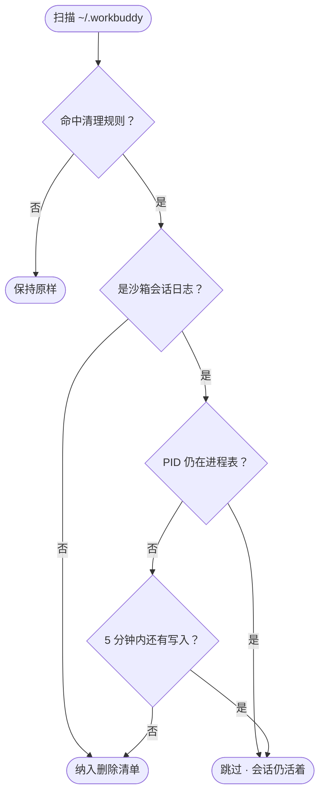

<h1 align="center">🧹 workbuddy-sweep</h1>

<p align="center">
  <strong>给 <code>~/.workbuddy</code> 做减法</strong><br>
  扫描 → 预览 → 确认 → 清理。默认不删任何东西。
</p>

<p align="center">
  <a href="https://github.com/Congxiang1994/workbuddy-sweep"></a>
  <a href="https://github.com/Congxiang1994/workbuddy-sweep"></a>
  <a href="https://github.com/Congxiang1994/workbuddy-sweep"></a>
  <a href="https://github.com/Congxiang1994/workbuddy-sweep/blob/main/tests/run-tests.sh"></a>
  <a href="https://github.com/Congxiang1994/workbuddy-sweep"></a>
  <a href="LICENSE"></a>
</p>

<p align="center">
  <strong>简体中文</strong> · <a href="README.en.md">English</a>
</p>

---

[WorkBuddy](https://workbuddy.cn) 每天在 `~/.workbuddy` 下写日志、沙箱会话、追踪与缓存。跑上几周，它就从几百兆长到几个 G。

`workbuddy-sweep` 把它们收回来 —— 它只碰「缓存 / 历史 / 已结束会话」这三类数据，**运行时、已装插件、项目数据、凭据、记忆一律不动**。

```diff
  ~/.workbuddy   1.9G
-    ├─ logs/sandbox/            420M   已结束的沙箱会话日志
-    ├─ plugins/marketplaces/    146M   市场清单 zip 解压残留
-    ├─ app/session/Cache/        57M   Electron 渲染缓存
-    └─ traces/                   45M   调试追踪遥测
+ ~/.workbuddy   1.3G   ← 默认清理后
```

## 空间都去哪了

默认清理清单的实测构成（作者本机，2026-09-16）：

```
logs/sandbox/     ██████████████████████████████   420.0M   已结束会话
cache dirs        ████                              62.0M   冗余目录
app/session/      ████                              57.0M   Electron 缓存
traces/           ███                               45.0M   闲置追踪
logs/             ▌                                  8.4M   轮转旧日志
.DS_Store         ▏                                  0.4M   散落标记文件
──────────────────────────────────────────────────────────────
                                    合计 ≈ 588.8M（84 项）
plugins/marketplaces/  ██████████                  146.0M   ⚡ --aggressive
```

> [!NOTE]
> `logs/sandbox/` 通常一家独大。它是**当天**写下的文件，所以「删掉早于今天的日志」这类传统规则一条都抓不到 —— 这也是这个脚本存在的理由。

## 判定逻辑



两道闸门加一层冷却：**进程还活着就绝不碰**，刚写完的也不碰，其余才进清单。

## 会删除什么

| # | 类别 | 判定规则 | 实测 |
|---|---|---|---|
| 1 | `logs/` 历史日期目录 | 早于今天 | 3.4M |
| 2 | `logs/*.old.log` | 轮转旧日志 | 5.0M |
| 3 | `logs/` 过期零碎日志 | `connector-oauth-debug.log` 等 | — |
| 4 | **`logs/sandbox/` 会话日志** | **PID 已不存在** 且 ≥5 分钟无写入；非今天的日期目录整体删 | **420M** |
| 5 | `traces/*` | 闲置 ≥ 60 分钟（`TRACE_MAX_AGE_MIN`） | 45M |
| 6 | 缓存 / 冗余目录 | `skills-marketplace` `connectors-marketplace` `cache` `file-tree-manifests` `shell-snapshots` `clipboard-images` `blobs` `file-history` `changes-detail` | 62M |
| 7 | **`app/session/` Electron 纯缓存** | `Cache` `Code Cache` `GPUCache` `DawnWebGPUCache` `DawnGraphiteCache` `Shared Dictionary` | 57M |
| 8 | `backup-memory-YYYYMMDD` | 过期记忆备份 | — |
| 9 | 散落 `.DS_Store` | `WB_HOME` 下 3 层内 | 408K |
| ⚡ | `plugins/marketplaces/` | 仅 `--aggressive`，下次打开自动重拉 | 146M |

## 不会删除什么

- **活着的沙箱会话** —— `sandbox_<pid>_*` 中 PID 仍在进程表的一律跳过
- **正在写入的活跃日志** —— `daemon.log`、`main.log`、`renderer.log`、`mcp-apps-diag.log`、`file-service.log`、`AppStartup.log`，以及 `logs/` 中今天的日期目录
- **`binaries/`** —— Python + Node 托管运行时，所有工具都依赖它
- **`plugins/cache/`** —— 已安装插件的实际位置（`installed_plugins.json` 的 `installPath` 指向这里）
- **登录态** —— `app/session/` 下 `WebStorage`、`IndexedDB`、`Local Storage`、`Session Storage`、`Partitions`
- **你的数据** —— `projects/`、`security/`、`credentials/`、`memory/`、`skills/`、`workspace/`、`storage/`、`local_storage/`、`audit-log/`

## 安装

```bash
curl -O https://raw.githubusercontent.com/Congxiang1994/workbuddy-sweep/main/workbuddy-sweep.sh
chmod +x workbuddy-sweep.sh
```

或者直接 clone 本仓库。

## 使用

```bash
./workbuddy-sweep.sh                        # 预览：列出可删项 + 预计释放空间
./workbuddy-sweep.sh --apply                # 执行删除
./workbuddy-sweep.sh --aggressive           # 预览时额外纳入 plugins/marketplaces
./workbuddy-sweep.sh --apply --aggressive   # 一次清到底
```

> [!TIP]
> 先跑不带参数的预览，确认清单符合预期，再执行 `--apply`。想在副本上试跑，用 `WB_HOME=/tmp/fake bash workbuddy-sweep.sh --apply`。

<details>
<summary><b>可调环境变量</b></summary>

<br>

| 变量 | 默认 | 说明 |
|---|---|---|
| `WB_HOME` | `~/.workbuddy` | 目标目录，便于在副本上试跑 |
| `TRACE_MAX_AGE_MIN` | `60` | `traces/` 闲置多少分钟即回收 |
| `SANDBOX_COOLDOWN_MIN` | `5` | 沙箱会话多少分钟无写入才认定已结束 |

</details>

<details>
<summary><b>输出示例</b></summary>

<br>

预览阶段：

```
================ 扫描结果 ================

[logs/sandbox 已结束会话]
  128.7M   logs/sandbox/20260916  pid=6721（14 个文件）
  100.3M   logs/sandbox/20260916  pid=6445(center)（10 个文件）

[traces 闲置追踪]
  14.0M    traces/5550/（闲置 197 分钟）

[Electron 渲染缓存]
  53.6M    app/session/Cache
------------------------------------------
预计可释放空间: 588.8M（共 84 项）
清理前占用: 1.8G
```

`--apply` 后结尾会给出实际释放量与清理后占用：

```
================ 开始删除 ================
  [DEL] logs/sandbox/20260916  pid=6721（14 个文件）
  [DEL] traces/5550/
==========================================
成功 84 项，失败 0 项
实际释放空间: 588.8M（预计 588.8M）
清理后占用: 1.3G
```

</details>

## 设计要点

<details>
<summary><b>为什么沙箱日志要按 PID 判定</b></summary>

<br>

`logs/sandbox/` 的文件按 `sandbox_[center_]<pid>_{NNN.log,mmap3}` 命名。PID 仍在进程表里，说明会话还没结束，其中的 `.mmap3` 是正在写入的内存映射文件 —— 删掉会打断会话。

判定链：`ps -p <pid>` 优先；在受限环境（例如 agent 沙箱内，`ps` 会直接报 `operation not permitted`）自动回退到 `kill -0 <pid>`。两者都拿不准时，还有 `SANDBOX_COOLDOWN_MIN` 冷却兜底 —— 最近仍在写入的文件一律跳过。

</details>

<details>
<summary><b>为什么脚本里一个裸 <code>$var</code> 都不写</b></summary>

<br>

bash 判定变量名边界用的是 **locale 相关的 `isalnum()`**。UTF-8 locale 下，`$var` 后面紧跟的多字节字符（比如全角 `（`）会被吞进变量名：

```bash
printf 'set -u\npidlabel="OK"\necho "值=$pidlabel（测试）"\n' > /tmp/t.sh
LC_ALL=C           /bin/bash /tmp/t.sh   # 值=OK（测试）                退出码 0
LC_ALL=en_US.UTF-8 /bin/bash /tmp/t.sh   # pidlabel: unbound variable   退出码 1
```

同一份脚本，在你的终端崩溃、在别处正常 —— 这种 bug 极难定位。所以本项目全程使用 `${var}` 形式，并有测试覆盖。

</details>

<details>
<summary><b>为什么不删 <code>plugins/cache</code>，却敢删 <code>plugins/marketplaces</code></b></summary>

<br>

- `plugins/cache/`（81M）是**已安装插件的实际位置**，`installed_plugins.json` 的 `installPath` 直接指向它 —— 删了插件就废了。
- `plugins/marketplaces/`（146M）是市场清单的 zip 解压产物，没有 `.git`，且 `autoUpdate: true`，下次打开市场会自动重拉。代价只是市场页面短暂为空，所以单独收进 `--aggressive` 开关，不混进默认清单。

</details>

## 回归测试

```bash
bash tests/run-tests.sh
```

在 `/tmp` 建隔离 fixture 跑真实脚本，**分别在 `C` locale 与 `en_US.UTF-8` locale 下**断言 8 项：

- 退出码为 0、无 `unbound variable`
- 已结束会话被删、**存活 PID 会话被保留**
- 历史沙箱目录被删、闲置 traces 被回收、散落 `.DS_Store` 被删

双 locale 各 8 项，共 16 项。改动脚本后跑一次即可。

## 注意事项

> [!WARNING]
> 删除 `blobs/` 与 `file-history/` 会丢失文件版本 / 编辑历史（**不影响当前文件**）。其余项删掉后 WorkBuddy 会自动重建，无感。

- **仅适配 macOS**（使用 BSD `stat -f`）。Linux 需把 `stat -f '%m'` / `stat -f '%Sm' -t ...` 换成 GNU `stat -c '%Y'` / `stat -c '%y'`。
- 多次运行是幂等的，只会处理当下残留。
- 零依赖：只用 bash 与系统自带 `du` / `stat` / `ps`。

## License

[MIT](LICENSE)
