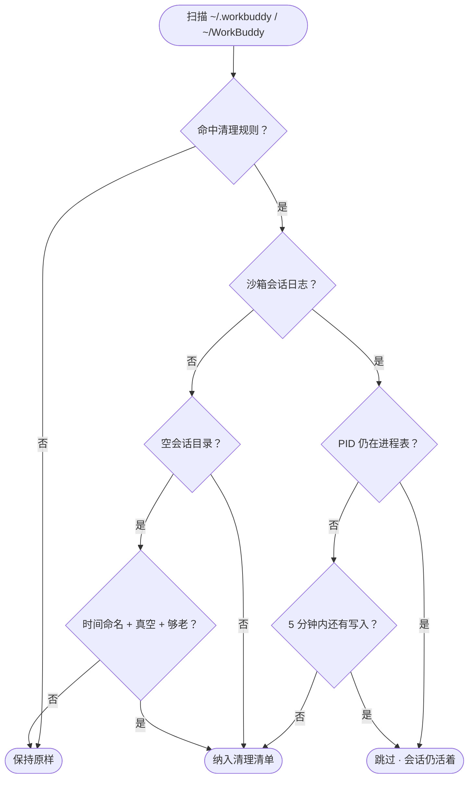
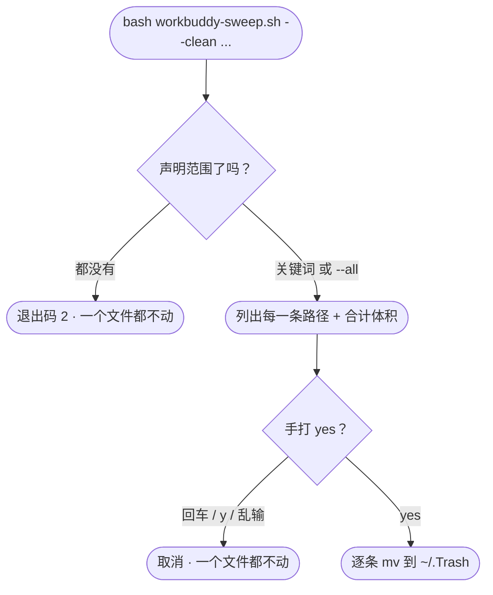

<h1 align="center">🧹 workbuddy-sweep</h1>

<p align="center">
  <strong>给 <code>~/.workbuddy</code> 和 <code>~/Library</code> 做减法</strong><br>
  扫描 → 预览 → 确认 → 清理。默认不删任何东西。
</p>

<p align="center">
  <a href="https://github.com/Congxiang1994/workbuddy-sweep"></a>
  <a href="https://github.com/Congxiang1994/workbuddy-sweep"></a>
  <a href="https://github.com/Congxiang1994/workbuddy-sweep"></a>
  <a href="https://github.com/Congxiang1994/workbuddy-sweep/tree/main/tests"></a>
  <a href="https://github.com/Congxiang1994/workbuddy-sweep"></a>
  <a href="LICENSE"></a>
</p>

<p align="center">
  <strong>简体中文</strong> · <a href="README.en.md">English</a>
</p>

---

本仓库两支脚本，各管一头：

| 脚本 | 盯的是什么 | 什么时候才动手 |
|---|---|---|
| **`workbuddy-sweep.sh`** | `~/.workbuddy` 的日志 / 缓存 / 已结束的沙箱会话，外加 `~/WorkBuddy` 下的空会话目录 | 默认只报告，`--clean <关键词 或 --all>` 后还要手打 `yes` |
| **`uninstall-residue.sh`** | 已卸载 App 遗留在 `~/Library` 的数据 | 默认只报告，`--clean <范围>` 后还要手打 `yes` |

两支的清理协议是同一套：**默认只读 → 范围必须显式声明 → 列清单 → 手打 `yes` → 移入废纸篓**。

---

[WorkBuddy](https://workbuddy.cn) 每天在 `~/.workbuddy` 下写日志、沙箱会话、追踪与缓存，`~/WorkBuddy` 下还会留下一个个按时间命名的会话目录。跑上几周，缓存从几百兆长到几个 G，工作目录里堆满空壳。

`workbuddy-sweep.sh` 把它们收回来 —— 它只碰「缓存 / 历史 / 已结束会话 / 空目录」这四类数据，**运行时、已装插件、项目数据、凭据、记忆一律不动**。

```diff
  ~/.workbuddy   1.9G
-    ├─ logs/sandbox/            420M   已结束的沙箱会话日志
-    ├─ plugins/marketplaces/    146M   市场清单 zip 解压残留
-    ├─ app/session/Cache/        57M   Electron 渲染缓存
-    └─ traces/                   45M   调试追踪遥测
+ ~/.workbuddy   1.3G   ← 默认清理后
```

## 空间都去哪了

默认清理清单的实测构成（作者本机，2026-09-16 重度状态）：

```
logs/sandbox/     ██████████████████████████████   420.0M   已结束会话
cache dirs        ████                              62.0M   冗余目录
app/session/      ████                              57.0M   Electron 缓存
traces/           ███                               45.0M   闲置追踪
logs/             ▌                                  8.4M   轮转旧日志
.DS_Store         ▏                                  0.4M   散落标记文件
会话目录          ▏                                  0.0M   空会话目录（去杂乱，不省空间）
──────────────────────────────────────────────────────────────
                                    合计 ≈ 588.8M
plugins/marketplaces/  ██████████                  146.0M   ⚡ --aggressive
```

> [!NOTE]
> `logs/sandbox/` 通常一家独大。它是**当天**写下的文件，所以「删掉早于今天的日志」这类传统规则一条都抓不到 —— 这也是这个脚本存在的理由。

## 两道闸

**第一道：扫描判定。** 什么进清单，什么永远不进。



**第二道：动手前确认。** 光有 `--clean` 不够，还得声明范围，再手打 `yes`。



> [!WARNING]
> **裸 `--clean` 会被拒绝执行（退出码 2）。** 范围要么是关键词筛选，要么是显式的 `--all` —— 手滑敲出来不会变成全量清理。

## 会清理什么

| # | 类别 | 判定规则 | 典型量 |
|---|---|---|---|
| 1 | `logs/` 历史日期目录 | 早于今天 | 3.4M |
| 2 | `logs/*.old.log` | 轮转旧日志 | 5.0M |
| 3 | `logs/` 过期零碎日志 | `connector-oauth-debug.log` 等 | — |
| 4 | **`logs/sandbox/` 会话日志** | **PID 已不存在** 且 ≥5 分钟无写入；非今天的日期目录整体走 | **420M** |
| 5 | `traces/*` | 闲置 ≥ 60 分钟（`TRACE_MAX_AGE_MIN`） | 45M |
| 6 | 缓存 / 冗余目录 | `skills-marketplace` `connectors-marketplace` `cache` `file-tree-manifests` `shell-snapshots` `clipboard-images` `blobs` `file-history` `changes-detail` | 62M |
| 7 | **`app/session/` Electron 纯缓存** | `Cache` `Code Cache` `GPUCache` `DawnWebGPUCache` `DawnGraphiteCache` `Shared Dictionary` | 57M |
| 8 | `backup-memory-YYYYMMDD` | 过期记忆备份 | — |
| 9 | 散落 `.DS_Store` | `WB_HOME` 下 3 层内 | 408K |
| 10 | **`~/WorkBuddy` 下的空会话目录** | 名字严格是 `YYYY-MM-DD-HH-MM-SS`，**真的一无所有**，且创建已超 60 分钟 | 0（去杂乱） |
| ⚡ | `plugins/marketplaces/` | 仅 `--aggressive`，下次打开自动重拉 | 146M |

## 不会清理什么

- **活着的沙箱会话** —— `sandbox_<pid>_*` 中 PID 仍在进程表的一律跳过
- **非空的会话目录** —— `~/WorkBuddy` 下只要有任何一条内容就保留
- **认不出主人的目录** —— 名字不是时间格式的一律不碰（比如 `Claw`），不替你拿主意
- **刚创建的会话目录** —— 创建不足 60 分钟的空目录跳过，可能是在跑的会话还没写文件
- **正在写入的活跃日志** —— `daemon.log`、`main.log`、`renderer.log`、`mcp-apps-diag.log`、`file-service.log`、`AppStartup.log`，以及 `logs/` 中今天的日期目录
- **`binaries/`** —— Python + Node 托管运行时，所有工具都依赖它
- **`plugins/cache/`** —— 已安装插件的实际位置（`installed_plugins.json` 的 `installPath` 指向这里）
- **登录态** —— `app/session/` 下 `WebStorage`、`IndexedDB`、`Local Storage`、`Session Storage`、`Partitions`
- **你的数据** —— `projects/`、`security/`、`credentials/`、`memory/`、`skills/`、`workspace/`、`storage/`、`local_storage/`、`audit-log/`

## 安装

```bash
curl -O https://raw.githubusercontent.com/Congxiang1994/workbuddy-sweep/main/workbuddy-sweep.sh
curl -O https://raw.githubusercontent.com/Congxiang1994/workbuddy-sweep/main/uninstall-residue.sh
chmod +x workbuddy-sweep.sh uninstall-residue.sh
```

或者直接 clone 本仓库。

## 使用

```bash
# ① 先看报告（不删任何东西）
./workbuddy-sweep.sh
./workbuddy-sweep.sh sandbox                 # 只看名字/路径含 sandbox 的项
./workbuddy-sweep.sh sandbox traces          # 多个关键词 = 并集
./workbuddy-sweep.sh traces --and 61354      # 交集（同时含两词才算）
./workbuddy-sweep.sh --only sandbox,traces   # 逗号连写，等价于空格分隔
./workbuddy-sweep.sh --aggressive            # 报告里额外含 plugins/marketplaces

# ② 确认没问题了再清（会先列清单，再要你手打 yes）
./workbuddy-sweep.sh --clean sandbox         # 只清含 sandbox 的项
./workbuddy-sweep.sh --clean --all           # 全部清单，同样要输入 yes
./workbuddy-sweep.sh --clean --all --aggressive
./workbuddy-sweep.sh --clean sandbox --yes   # 跳过二次确认（--yes 必须带筛选）
```

> [!TIP]
> 想在副本上试跑，用 `WB_HOME=/tmp/fake WB_WORKSPACES=/tmp/fake-ws bash workbuddy-sweep.sh --clean ...`。

筛选按**忽略大小写的子串**匹配「类别名 / 条目名 / 条目内任一完整路径」，可以一次给多个：

| 写法 | 含义 |
|---|---|
| `a b` | 并集，命中任一即可 |
| `a --and b` | 交集，两个都得命中 |
| `a,b` | 逗号连写 = 空格分隔 |
| `a b --and c` | `(a 或 b) 且 c`，可任意混排 |

> [!IMPORTANT]
> **筛选只按关键词走，不用报告编号。** 编号随清单排序变化，用它筛选等于把「删哪一项」绑在排序结果上。关键词不依赖排序：`sandbox traces` 和 `traces sandbox` 结果完全一致。

<details>
<summary><b>可调环境变量</b></summary>

<br>

| 变量 | 默认 | 说明 |
|---|---|---|
| `WB_HOME` | `~/.workbuddy` | 主目标目录 |
| `WB_WORKSPACES` | `~/WorkBuddy` | 会话工作目录根（空会话目录从这里找） |
| `TRACE_MAX_AGE_MIN` | `60` | `traces/` 闲置多少分钟即回收 |
| `SANDBOX_COOLDOWN_MIN` | `5` | 沙箱会话多少分钟无写入才认定已结束 |
| `EMPTY_SESSION_COOLDOWN_MIN` | `60` | 空会话目录的最短年龄（分钟） |
| `MAX_DELETE_PER_RUN` | `20` | 单次最多处理多少项，防手滑 |

</details>

<details>
<summary><b>报告与确认页长什么样</b></summary>

<br>

报告（2026-09-17 实测，节选）：

```
WorkBuddy 清理  WB_HOME=/Users/cong/.workbuddy  今天=2026-09-17
模式：只扫描，不删除任何文件

================ 扫描结果 ================

[logs 轮转旧日志]
  [01]     5.7M  logs/main.old.log
  [02]     5.0M  logs/renderer.old.log

[logs/sandbox 已结束会话]
  [03]     4.1M  logs/sandbox/20260917  pid=14143（2 个文件）
  [04]     2.0M  logs/sandbox/20260917  pid=52342(center)（1 个文件）
  …

[Electron 渲染缓存]
  [28]    67.8M  app/session/Cache

[空会话目录]
  [30]       0K  会话工作目录空目录（29 个，不占空间）

------------------------------------------
命中 30 项 / 65 处 / 合计 191.2M
清理前占用: 1.4G
空会话目录旁注: 9 个非空已保留；1 个创建不足 60 分钟跳过；1 个命名不符跳过

以上仅为报告，未删除任何文件。
```

`--clean` 之后进确认页 —— **每一条路径都摆出来**，再要你手打 `yes`：

```
================ 即将移入废纸篓 ================

[01] logs 轮转旧日志  ·  5.7M
       /Users/cong/.workbuddy/logs/main.old.log
[02] 会话工作目录空目录（29 个，不占空间）  ·  0K
       /Users/cong/WorkBuddy/2026-09-14-08-24-08
       /Users/cong/WorkBuddy/2026-09-15-09-26-56
       …

合计 30 项 / 65 处 / 191.2M
（这些都会进 /Users/cong/.Trash，不是真删，随时可拖回来）

以上就是要移入废纸篓的全部内容。
  yes  = 确认，全部移入废纸篓
  pick = 逐项挑选
  其它 = 取消（什么都不做）
> 
```

</details>

## 设计要点

<details>
<summary><b>为什么沙箱日志要按 PID 判定</b></summary>

<br>

`logs/sandbox/` 的文件按 `sandbox_[center_]<pid>_{NNN.log,mmap3}` 命名。PID 仍在进程表里，说明会话还没结束，其中的 `.mmap3` 是正在写入的内存映射文件 —— 删掉会打断会话。

判定链：`ps -p <pid>` 优先；在受限环境（例如 agent 沙箱内，`ps` 会直接报 `operation not permitted`）自动回退到 `kill -0 <pid>`。两者都拿不准时，还有 `SANDBOX_COOLDOWN_MIN` 冷却兜底 —— 最近仍在写入的文件一律跳过。

</details>

<details>
<summary><b>空会话目录凭什么判定「空的」</b></summary>

<br>

`~/WorkBuddy` 下是按会话开始时间命名的目录（`2026-09-17-15-00-44`）。三个条件**同时**满足才动手：

1. **名字严格匹配** `YYYY-MM-DD-HH-MM-SS` —— 不匹配的一律跳过。目录里可能混着别的东西（比如 `Claw`），脚本认不出它属于谁，就不替你动。
2. **真的空** —— 用 `ls -A | head -1` 判，只要有一条内容（包括 `.DS_Store`）就保留。
3. **够老** —— 创建不足 `EMPTY_SESSION_COOLDOWN_MIN`（默认 60 分钟）的跳过。会话目录在会话**开始**时就会创建，一个刚出现、还空着的目录很可能是在跑的会话还没来得及写文件。

不满足任何一条都不进清单；跳过多少个、为什么跳过，会在报告里明说：

```
空会话目录旁注: 9 个非空已保留；1 个创建不足 60 分钟跳过；1 个命名不符跳过
```

> [!NOTE]
> 空目录不占空间（`du` 是 0K），清它**不省磁盘**，纯粹是去杂乱 —— 所以它单独一类列出来，别指望它带来体积收益。

</details>

<details>
<summary><b>为什么是「移入废纸篓」而不是 <code>rm</code></b></summary>

<br>

`rm` 之后的后悔是不可逆的。脚本统一用 `mv` 把目标搬进 `~/.Trash`，**随时可以拖回来**。名字撞车时自动加时间戳后缀。

代价要说清楚：**废纸篓里的东西仍然占磁盘**，清空废纸篓之后空间才真正释放。所以脚本结尾不会吹「已释放 XXX M」，而是告诉你东西在哪。

</details>

<details>
<summary><b>为什么脚本里一个裸 <code>$var</code> 都不写</b></summary>

<br>

bash 判定变量名边界用的是 **locale 相关的 `isalnum()`**。UTF-8 locale 下，`$var` 后面紧跟的多字节字符（比如全角 `（`）会被吞进变量名：

```bash
printf 'set -u\npidlabel="OK"\necho "值=$pidlabel（测试）"\n' > /tmp/t.sh
LC_ALL=C           /bin/bash /tmp/t.sh   # 值=OK（测试）                退出码 0
LC_ALL=en_US.UTF-8 /bin/bash /tmp/t.sh   # pidlabel: unbound variable   退出码 1
```

同一份脚本，在你的终端崩溃、在别处正常 —— 这种 bug 极难定位。所以本项目全程使用 `${var}` 形式，并有测试覆盖。

</details>

<details>
<summary><b>为什么不删 <code>plugins/cache</code>，却敢删 <code>plugins/marketplaces</code></b></summary>

<br>

- `plugins/cache/`（81M）是**已安装插件的实际位置**，`installed_plugins.json` 的 `installPath` 直接指向它 —— 删了插件就废了。
- `plugins/marketplaces/`（146M）是市场清单的 zip 解压产物，没有 `.git`，且 `autoUpdate: true`，下次打开市场会自动重拉。代价只是市场页面短暂为空，所以单独收进 `--aggressive` 开关，不混进默认清单。

</details>

## 另一支：`uninstall-residue.sh`

卸载一个 App 只是把 `.app` 拖进废纸篓 —— 它在 `~/Library` 里攒下的数据一个都不会跟着走。几个月后你会看着 `Application Support` 里一堆不认识的名字发愣。

这一支负责把它们挖出来。**它只报告，不删任何东西**：按软件聚合、给出每条路径与体积，留不留由你定。

我本机的真实输出（2026-09-17）：

```
[09] Docker Desktop
     待确认 · 合计 320K · 最近改动 2026-06-11
           232K  ~/Library/Application Support/Docker Desktop
             4K  ~/Library/Preferences/com.electron.dockerdesktop.plist
            84K  ~/Library/Group Containers/group.com.docker

[11] com.tencent.bugly
     基本确定 · 合计 36K · 最近改动 2026-09-17
             4K  ~/Library/Application Support/com.tencent.bugly
             4K  ~/Library/Preferences/com.tencent.tds.bugly.plist
             …

------------------------------------------------------
共 24 项（基本确定 19 / 待确认 5），合计 154.8M
```

> 报告尾部是按**软件**计数（同一软件散落各处的痕迹算一项），上面那句「命中 41 处」是按**路径**计数 —— 两个数不同是正常的。

### 怎么判断「已卸载」

macOS 没有 API 能告诉你「这个目录的主人还在不在」，所以走指纹比对：

1. **先收集当前真正装着的 App** —— 扫 `/Applications`、`/System/Applications`、`Utilities`、`~/Applications`、输入法目录，用 `PlistBuddy` 读出每个 App 的 bundle id、App 名，以及 bundle id 里的组织段；
2. **再遍历 `~/Library` 下最容易堆残留的位置**；
3. 任何「名字是标准 bundle id，或是某个软件的名字，却在指纹里找不到对应物」的条目，判为疑似残留。

### 扫描范围

扫描时会画进度条（0 → 100%，带当前目录），写到 `stderr`，所以 `stdout` 的报告依然可以直接重定向成文件。

| 位置 | 说明 |
|---|---|
| `Application Support` | 大户，App 的数据基本都在这 |
| `Caches` / `WebKit` / `HTTPStorages` | 缓存与 WebKit 存储 |
| `Preferences` | `*.plist` 偏好 |
| `Containers` / `Group Containers` | 沙箱容器（自动剥掉 10 位 team id 前缀） |
| `Logs` / `Saved Application State` | 日志与窗口状态 |
| `LaunchAgents` / `Cookies` / `Application Scripts` / `Services` | 零散痕迹 |

`--system` 额外扫 `/Library`（只读；真要清理得 sudo）。

### 三种标注

| 标签 | 含义 |
|---|---|
| **基本确定** | 名字长得就是标准软件标识（`com.xxx.yyy`），系统里却没装这个软件 |
| **待确认** | 只是个普通文件夹名（如 `Docker Desktop`），系统里没有同名软件 |
| **归属不明** | 认不出属于谁，可能只是系统 / 开发工具的目录 —— 默认不显示，`--all` 才列出 |

### 用法

```bash
./uninstall-residue.sh                 # 扫描 + 报告（不删任何东西）
./uninstall-residue.sh sogou           # 只看名字或路径含 sogou 的项
./uninstall-residue.sh sogou baidu     # 多个关键词 = 并集
./uninstall-residue.sh sogou --and pinyin  # 交集：同时含两词才算
./uninstall-residue.sh --all           # 加上「归属不明」项
./uninstall-residue.sh --min-age 180   # 只看 180 天以上没被动过的
./uninstall-residue.sh --system        # 额外扫 /Library
./uninstall-residue.sh --clean sogou   # 列出清单 → 输入 yes → 只清那几组
./uninstall-residue.sh --clean --all   # 列出全部清单 → 输入 yes → 全部清
```

### 只删其中一部分

绝大多数时候你只想清掉几个，不想一把全删 —— 把**关键词**接在 `--clean` 后面就行：

```bash
./uninstall-residue.sh --clean sogou             # 组名或组内路径含 sogou
./uninstall-residue.sh --clean sogou baidu       # 并集：含 sogou 或 baidu
./uninstall-residue.sh --clean sogou,baidu       # 逗号连写，等价于上面
./uninstall-residue.sh --clean sogou --and pinyin # 交集：同时含两词
./uninstall-residue.sh --clean sogou google --and updater  # (sogou 或 google) 且 updater
```

筛选按**忽略大小写的子串**匹配「组名」或「组内任一完整路径」，可以一次给多个：

| 写法 | 含义 |
|---|---|
| `a b` | 并集，命中任一即可 |
| `a --and b` | 交集，两个都得命中 |
| `a,b` | 逗号连写 = 空格分隔 |
| `a b --and c` | `(a 或 b) 且 c`，可任意混排 |

> [!IMPORTANT]
> **筛选只按关键词走，不用报告编号。** 编号随清单排序变化，用它筛选等于把「删哪一项」绑在排序结果上 —— 换个参数就可能删错东西。关键词不依赖排序：`sogou baidu` 和 `baidu sogou` 结果完全一致，重复执行也不会漂移。

### 三道闸门，没有「手滑全清」这条路

**① 范围必须显式写出来。** 裸 `--clean` 什么都不会动，直接拒绝执行（退出码 2）：

```
⚠️  没有指定范围，本次不会动任何文件。
    只清几项：    bash uninstall-residue.sh --clean <关键词>
    全部都要清：  bash uninstall-residue.sh --clean --all
```

**② 动手前先摆清单。** 确认前会把**即将移入废纸篓的每一条路径**连同体积原样列出，最后给一行合计：

```
================ 即将移入废纸篓 ================

[01] GhostApp  ·  40K  ·  待确认
            32K  ~/Library/Application Support/GhostApp
             8K  ~/Library/Logs/GhostApp.log

[02] com.ghost.software  ·  12K  ·  基本确定
            12K  ~/Library/Caches/com.ghost.software

合计 2 组 / 3 处 / 52K
```

**③ 必须手打 `yes`。** 回车、`y`、乱输都算取消，一个文件都不动：

```
  yes  = 确认，全部移入废纸篓
  pick = 逐组挑选
  其它 = 取消（什么都不做）
```

`--yes` 可以跳过这道确认 —— 但**必须带筛选条件**（`--all` 不算），所以 `--clean --all --yes` 这种「一句话全清空」被刻意堵死（退出码 2）。

### 清理走废纸篓，不走 `rm`

确认后 `mv` 到 `~/.Trash`，**随时拖回来就能还原**。单次最多处理 20 组，防手滑（`MAX_DELETE_PER_RUN` 可调）。

`pick` 模式下逐组询问：`y` 整组移入 / `n` 跳过 / `s` 逐条挑 / `q` 退出。

> [!NOTE]
> 「归属不明」的项脚本**永远不碰**，哪怕带了 `--all`。那些目录认不出主人，脚本不替你拿主意。


### 白名单

系统目录与常驻更新器一律不报：`com.apple.*`、`com.google.*`、`com.microsoft.autoupdate*`，以及 `AddressBook` `CloudDocs` `MobileSync` `Knowledge` 等共享目录。清单就在脚本顶部的 `IGNORE_ID_PREFIXES` / `IGNORE_NAMES`，想加自己的直接改那两处。

> [!NOTE]
> 判定必然有误差 —— 同一个目录既可能是「卸载 App 的残留」，也可能是「某个仍在用的工具的缓存」。所以这一支**只给路径和证据，不替你下结论**：报告里每一条都带着体积和最后修改时间，是不是该删，看一眼就知道。

## 回归测试

```bash
bash tests/run-tests.sh                      # workbuddy-sweep.sh      104 项
bash tests/run-tests-uninstall-residue.sh    # uninstall-residue.sh   140 项
```

两支都在 `/tmp` 建隔离 fixture 跑真实脚本，**分别在 `C` locale 与 `en_US.UTF-8` locale 下**断言。

**`workbuddy-sweep.sh`**（52 项 × 2 locale，全程隔离 `HOME`，绝不碰真实的 `~/.workbuddy`、`~/WorkBuddy` 与 `~/.Trash`）：

- **只读默认** —— 不带 `--clean` 时一个文件都不动
- **范围闸** —— 裸 `--clean`、`--clean --all --yes`、`--clean --yes`（无筛选）、旧参数 `--apply`，全部退出码 2
- **二次确认** —— 回车 / `y` / 乱输都必须取消且文件仍在；打 `yes` 后才移走；`pick` 下答 `n` 的项不动
- **清理规则** —— 存活 PID 会话保留；空会话目录只清「老的 + 真空 + 时间命名的」，刚创建的、非空的、命名不符的一律保留
- **筛选** —— 并集、`--and` 交集、无命中，以及「未命中的项原样未动」

每个用例前重建 fixture，多个清理用例之间不会互相污染。

**`uninstall-residue.sh`**（70 项 × 2 locale，全程隔离 `HOME`，绝不碰真实 `~/Library`）：

- 未装 App 的残留被报出，同一软件散落各处的痕迹聚合成一组
- 已装 App 的数据（App 名 / bundle id / helper 子 id 三种形态）**不被误报**
- 白名单生效，且 **Group Containers 的 team id 剥离不越界**
- 进度条走 `stderr`、跑到 100%，且**不污染 `stdout`**
- 筛选只列、只动命中的组，未命中的原地不动
- **多关键词**：并集 / `--and` 交集 / 逗号连写 / `a b --and c` 混排均正确；关键词顺序不影响结果
- **裸 `--clean` 被拒**、**`--clean --all --yes` 被拒**、`--yes` 不带筛选被拒、**空转的 `--and` 也放行不了 `--yes`**
- 二次确认：先列清单 → 回车取消则一个文件都没动 → 输入 `yes` 才执行
- `pick` 模式逐组挑选时，答 `y` 的动、答 `n` 的不动
- 加了关键词筛选后，报告编号不变、未命中的组不出现在报告里
- 默认模式一个文件都不删；`--clean` 后原位置消失、废纸篓里能找到

## 注意事项

> [!WARNING]
> 删除 `blobs/` 与 `file-history/` 会丢失文件版本 / 编辑历史（**不影响当前文件**）。其余项删掉后 WorkBuddy 会自动重建，无感。

- **仅适配 macOS**（依赖 BSD `stat -f`、`PlistBuddy`、`du -sk`）。Linux 需把 `stat -f '%m'` / `stat -f '%Sm' -t ...` 换成 GNU `stat -c '%Y'` / `stat -c '%y'`，`PlistBuddy` 也没有对应物。
- 两支的清理**都走废纸篓**（`mv` 到 `~/.Trash`），随时可拖回；**清空废纸篓之后磁盘空间才真正释放**。
- 两支的报告编号都只能看、不能筛 —— 筛选一律按关键词走，免得清单排序一变就删错东西。
- 多次运行是幂等的，只会处理当下残留。达到 `MAX_DELETE_PER_RUN` 上限时清单里剩下的原样未动，重跑一次继续。
- 零依赖：只用 bash 与系统自带 `du` / `stat` / `ps` / `mv` / `PlistBuddy`。
- 两支脚本都不联网、不调用 sudo、不改任何系统设置。
- `uninstall-residue.sh` 的报告默认写到当前目录（`uninstall-residue-<时间戳>.tsv`），可用 `--report 路径` 指定，或直接改脚本里的 `REPORT_FILE` 默认值。

## License

[MIT](LICENSE)
